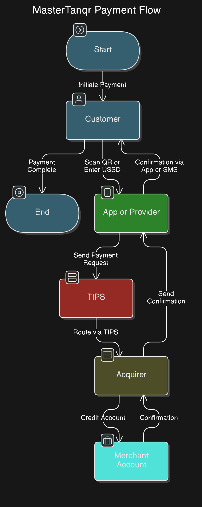

# Unified QR Payment System Flow

##  Process Overview

1. **Merchant Registration**  
   - Merchant registers using **TIN** or a **unified Lipa Number (e.g., TN123456789)**.  
   - The system links this identifier to **M-Pesa, Tigo Pesa, and Airtel Money accounts**.  

2. **QR Code Generation**  
   - A **TANQR-compliant QR code** is generated, embedding the merchant’s identifier.  
   - The merchant displays the QR code for customers.  

3. **Customer Payment**  
   - Customer scans the QR code using their **preferred mobile money app**.  
   - The app extracts the **merchant’s identifier** and sends a payment request.  

4. **Neutral Acquirer Processing**  
   - The transaction is sent to the **neutral acquirer**, which identifies the correct **linked merchant account**.  
   - The acquirer processes and forwards the payment to the appropriate provider (M-Pesa, Tigo Pesa, or Airtel Money).  

5. **Transaction Completion**  
   - Customer receives a **payment confirmation**.  
   - Merchant sees the transaction reflected in their **dashboard**.  

6. **Reporting & Reconciliation**  
   - The system aggregates transactions from **all providers** into a **unified dashboard**.  
   - Merchants can **track payments, generate reports, and manage finances**.  

## 🖼️ Visual Representation

  

This flow ensures seamless, **interoperable** payments while maintaining **compliance with TANQR and TIPS regulations**. 

